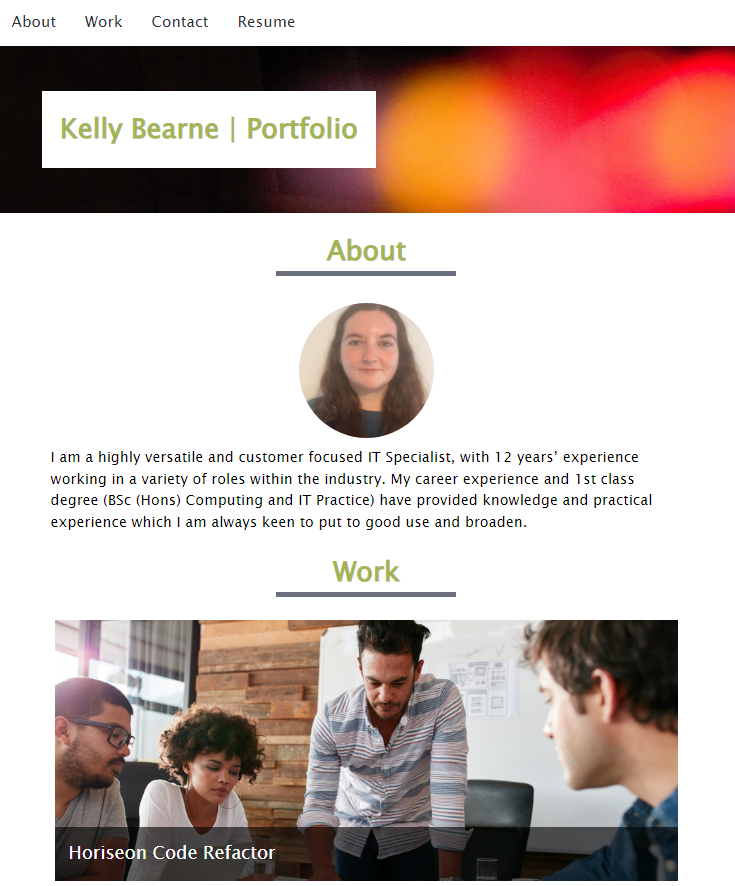

# kelly-bearne-portfolio

## Description

This project fullfils the criteria of building an effective portfolio to highlight my strongest work.

The site is responsive to mobile, tablet and desktop breakpoints; achieved through the use of three media queries. Both CSS Grid and Flex are utilised in this project.

The codebase follows best practice throughout (e.g. semantic HTML, class / ID naming conventions, indentation, quality comments and CSS variables).

## Installation

N/A

## Usage

Access the deployed application at the following URL: https://kbearne.github.io/kelly-bearne-portfolio

This site is responsive to mobile, tablet and desktop breakpoints. It contains a (reactive) navigation section, a header, about section, work (my portfolio) section and a footer section.

## Built with

  

## Credits

The following tutorial was followed to create the reactive navigation: https://www.w3schools.com/howto/howto_js_topnav_responsive.asp

## License

MIT license